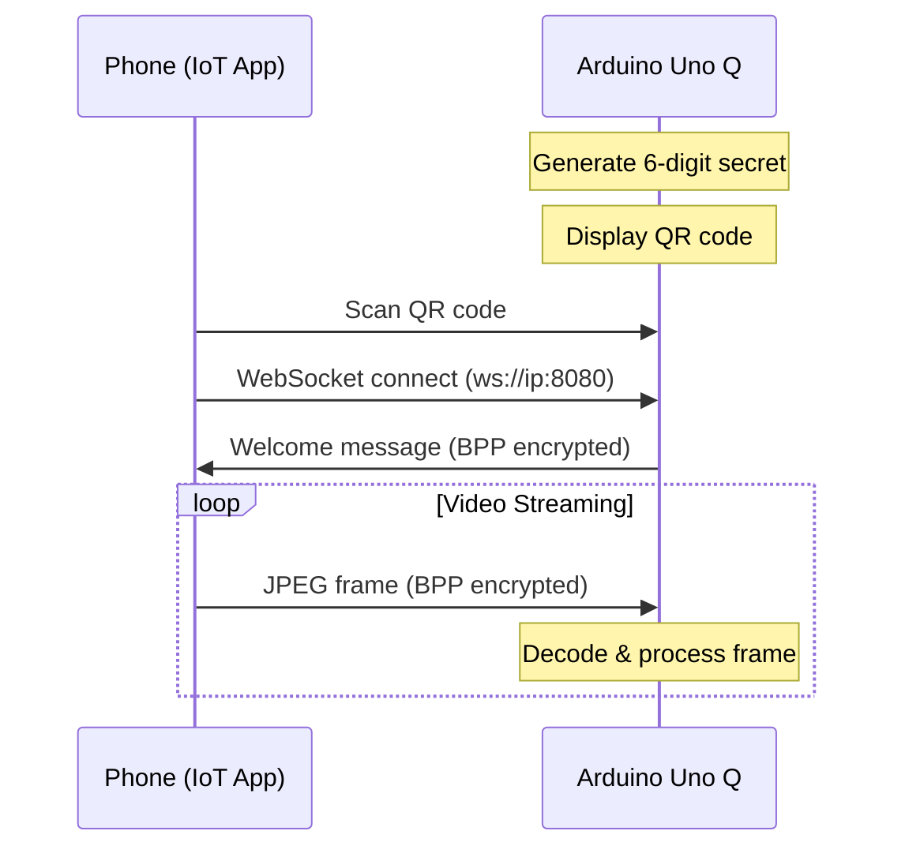

```
 ██████████
▒▒███▒▒▒▒███
 ▒███   ▒▒███ ████████   ██████    ███████  ██████  ████████
 ▒███    ▒███▒▒███▒▒███ ▒▒▒▒▒███  ███▒▒███ ███▒▒███▒▒███▒▒███
 ▒███    ▒███ ▒███ ▒▒▒   ███████ ▒███ ▒███▒███ ▒███ ▒███ ▒███
 ▒███    ███  ▒███      ███▒▒███ ▒███ ▒███▒███ ▒███ ▒███ ▒███
 ██████████   █████    ▒▒████████▒▒███████▒▒██████  ████ █████
▒▒▒▒▒▒▒▒▒▒   ▒▒▒▒▒      ▒▒▒▒▒▒▒▒  ▒▒▒▒▒███ ▒▒▒▒▒▒  ▒▒▒▒ ▒▒▒▒▒
                                  ███ ▒███
                                 ▒▒██████
                                  ▒▒▒▒▒▒
 █████   ███   █████  ███
▒▒███   ▒███  ▒▒███  ▒▒▒
 ▒███   ▒███   ▒███  ████  ████████    ███████            ████████   █████
 ▒███   ▒███   ▒███ ▒▒███ ▒▒███▒▒███  ███▒▒███ ██████████▒▒███▒▒███ ███▒▒
 ▒▒███  █████  ███   ▒███  ▒███ ▒███ ▒███ ▒███▒▒▒▒▒▒▒▒▒▒  ▒███ ▒▒▒ ▒▒█████
  ▒▒▒█████▒█████▒    ▒███  ▒███ ▒███ ▒███ ▒███            ▒███      ▒▒▒▒███
    ▒▒███ ▒▒███      █████ ████ █████▒▒███████            █████     ██████
     ▒▒▒   ▒▒▒      ▒▒▒▒▒ ▒▒▒▒ ▒▒▒▒▒  ▒▒▒▒▒███           ▒▒▒▒▒     ▒▒▒▒▒▒
                                      ███ ▒███
                                     ▒▒██████
                                      ▒▒▒▒▒▒


Rust libraries for the Arduino Uno Q platform
featuring:

* Post-Quantum Cryptography
* Anonymous credentials
* Secure storage
* Phone integration via Arduino IoT Companion App
```

## Features

- **Post-Quantum Cryptography**: ML-KEM 768, ML-DSA 65, X-Wing hybrid KEM
- **Classical Cryptography**: Ed25519, X25519, XChaCha20-Poly1305
- **Anonymous Credentials**: SAGA (BBS-style MAC scheme)
- **Secure Storage**: PSA-compliant encrypted storage
- **Cross-Platform RPC**: MessagePack-RPC over SPI
- **Phone Integration**: Stream video from phones via Arduino IoT Companion App

## Quick Start

### If Firmware is Already Flashed

If your board already has MCU firmware flashed (e.g., from previous development):

```bash
# Set up board credentials
cp .env.example .env
# Edit .env with your board's IP and password

# Run a demo directly (no build required)
source .env && make run DEMO=pqc/psa
```

### Full Build from Scratch

If you need to build and flash everything:

```bash
# Clone the repository
git clone https://github.com/AnomalyCo/DragonWing-rs.git
cd DragonWing-rs

# Set up board credentials
cp .env.example .env
# Edit .env with your board's IP and password

# Build Docker image (for MCU builds) - first time only
make docker-build

# Build and flash MCU firmware
make build-mcu DEMO=pqc-demo
source .env && make flash

# Build and deploy MPU client
make build-mpu APP=pqc-client
source .env && make deploy APP=pqc-client

# Run a demo
source .env && make run DEMO=pqc/psa
```

### Make Commands

| Command                   | Description                                  |
| ------------------------- | -------------------------------------------- |
| `make run DEMO=pqc/psa`   | Run demo on **already flashed** firmware     |
| `make demo DEMO=pqc/psa`  | Full workflow: build, flash, deploy, and run |
| `make build-mcu DEMO=...` | Build MCU firmware only (requires Docker)    |
| `make flash`              | Flash firmware to board                      |
| `make build-mpu APP=...`  | Build MPU application                        |
| `make deploy APP=...`     | Deploy MPU app to board                      |

## Project Structure

```
DragonWing-rs/
├── crates/                      # Reusable libraries
│   ├── dragonwing-crypto/       # PQ & classical cryptography
│   ├── dragonwing-led-matrix/   # 8x13 LED matrix driver
│   ├── dragonwing-remote-iot/   # Arduino IoT Companion App integration
│   ├── dragonwing-rpc/          # Cross-platform RPC
│   ├── dragonwing-spi/          # SPI communication
│   ├── dragonwing-spi-router/   # SPI router daemon
│   └── dragonwing-zcbor/        # CBOR/COSE encoding
├── demos/
│   ├── mcu/                     # MCU firmware demos
│   │   ├── pqc-demo/            # Post-quantum showcase
│   │   ├── led-matrix-demo/     # LED animations
│   │   └── ...
│   └── mpu/                     # Linux application demos
│       ├── pqc-client/          # PQC demo controller
│       ├── remote-iot/          # Phone camera streaming
│       ├── weather-display/     # Weather on LED matrix
│       └── ...
├── docs/                        # Documentation
├── docker/                      # Zephyr build environment
└── config/                      # Board configurations
```

## Available Demos

### MCU Firmware

| Demo              | Description                                                             |
| ----------------- | ----------------------------------------------------------------------- |
| `pqc-demo`        | Full cryptography showcase (ML-KEM, X-Wing, SAGA, Ed25519, PSA storage) |
| `led-matrix-demo` | LED matrix animations and patterns                                      |
| `mlkem-demo`      | ML-KEM 768 key encapsulation                                            |
| `rpc-server`      | RPC server with LED matrix control                                      |

### MPU Applications

| App               | Description                                    |
| ----------------- | ---------------------------------------------- |
| `pqc-client`      | Control MCU demos via RPC                      |
| `mlkem-client`    | ML-KEM key exchange client                     |
| `remote-iot`      | Phone camera streaming via IoT Companion App   |
| `weather-display` | Fetch weather and display on LED matrix        |
| `spi-router`      | SPI router daemon (required for RPC)           |

### Demo Commands

```bash
# After flashing pqc-demo and starting spi-router:

./pqc-client --psa-demo           # PSA secure storage
./pqc-client --xwing-demo         # X-Wing hybrid PQ KEM
./pqc-client --saga-demo          # SAGA anonymous credentials
./pqc-client --saga-xwing-demo    # Combined credential + key exchange
./pqc-client --persistence-demo   # Persistent credential storage
./pqc-client --ed25519-demo       # Ed25519 signatures (fast)
./pqc-client --mlkem-demo         # ML-KEM 768 (medium)
./pqc-client --mldsa-demo         # ML-DSA 65 (slow)
```

## Phone Integration (Arduino IoT Companion App)

Stream video from your phone to the Arduino Uno Q using the [Arduino IoT Remote](https://play.google.com/store/apps/details?id=cc.arduino.iotremote) app.

### Quick Start

```bash
# Run the remote-iot demo
cargo run -p remote-iot-demo

# Or with options
cargo run -p remote-iot-demo -- --port 8080 --verbose
```

The demo will:
1. Start a WebSocket camera server
2. Display a QR code for the Arduino IoT Remote app to scan
3. Receive encrypted video frames from your phone

### How It Works



### Protocol Details

The `dragonwing-remote-iot` crate implements the **BPP (Binary Peripheral Protocol)** used by Arduino's official tools:

| Feature | Description |
|---------|-------------|
| Transport | WebSocket on port 8080 |
| Security | ChaCha20-Poly1305 encryption with HMAC-SHA256 option |
| Authentication | 6-digit shared secret |
| Data Format | BPP-encoded JPEG frames |

### API Usage

```rust
use dragonwing_remote_iot::{CameraServerBuilder, CameraEvent, QrGenerator};

// Create camera server with encryption
let camera = CameraServerBuilder::new()
    .port(8080)
    .use_encryption(true)
    .build();

// Display QR code
println!("{}", QrGenerator::generate_camera_pairing_display(&camera));

// Handle events
let mut events = camera.subscribe();
tokio::spawn(async move {
    while let Ok(event) = events.recv().await {
        match event {
            CameraEvent::FrameReceived { size, .. } => {
                println!("Got frame: {} bytes", size);
            }
            _ => {}
        }
    }
});

// Run server
camera.run("0.0.0.0:8080".parse()?).await?;
```

## Cryptographic Algorithms

| Algorithm          | Type                   | Standard   | Performance (MCU) |
| ------------------ | ---------------------- | ---------- | ----------------- |
| ML-KEM 768         | Post-Quantum KEM       | FIPS 203   | ~60ms             |
| ML-DSA 65          | Post-Quantum Signature | FIPS 204   | ~30-60s           |
| X-Wing             | Hybrid PQ KEM          | IETF Draft | ~100ms            |
| Ed25519            | Signature              | RFC 8032   | <10ms             |
| X25519             | Key Agreement          | RFC 7748   | <10ms             |
| XChaCha20-Poly1305 | AEAD                   | RFC 8439+  | <5ms              |
| ChaCha20-Poly1305  | AEAD (BPP)             | RFC 8439   | <5ms              |
| SAGA               | Anonymous Credentials  | Research   | ~100ms            |

## Documentation

- [Getting Started](docs/GETTING_STARTED.md) - Setup and first steps
- [Architecture](docs/ARCHITECTURE.md) - System design and data flow
- [Cryptography](docs/CRYPTOGRAPHY.md) - Algorithm details and usage

## Building

### Prerequisites

- **Rust**: `rustup` with `aarch64-unknown-linux-gnu` target
- **Docker**: For MCU builds with Zephyr SDK
- **cargo-zigbuild**: For MPU cross-compilation

### MCU (Zephyr)

```bash
make docker-build              # Build Docker image (once)
make build-mcu DEMO=pqc-demo   # Build firmware
make flash                     # Flash via OpenOCD
```

### MPU (Linux)

```bash
make build-mpu APP=pqc-client  # Cross-compile for aarch64
make deploy APP=pqc-client     # Deploy via SSH
```

## License

Licensed under either of:

- Apache License, Version 2.0 ([LICENSE-APACHE](LICENSE-APACHE) or http://www.apache.org/licenses/LICENSE-2.0)
- MIT License ([LICENSE-MIT](LICENSE-MIT) or http://opensource.org/licenses/MIT)

at your option.

## Contributing

Contributions are welcome! Please feel free to submit a Pull Request.
