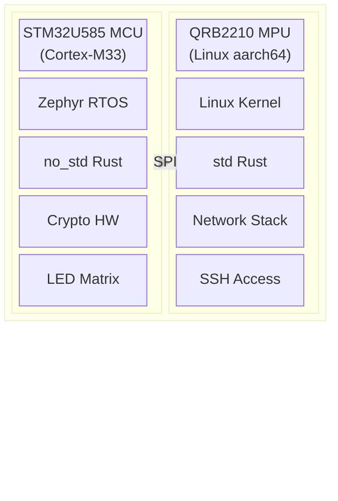
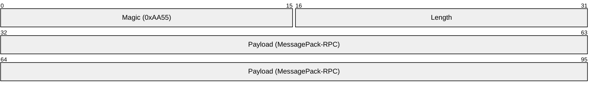
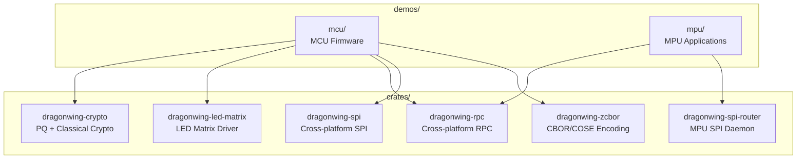
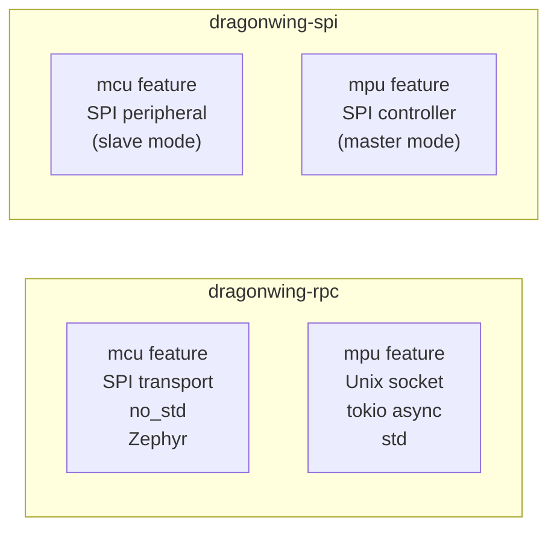
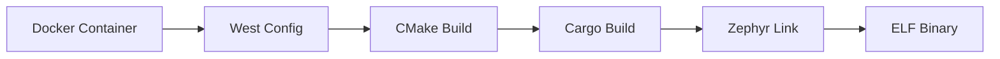
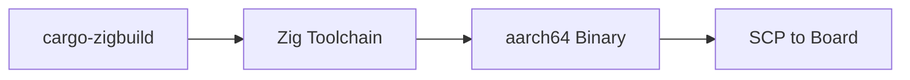
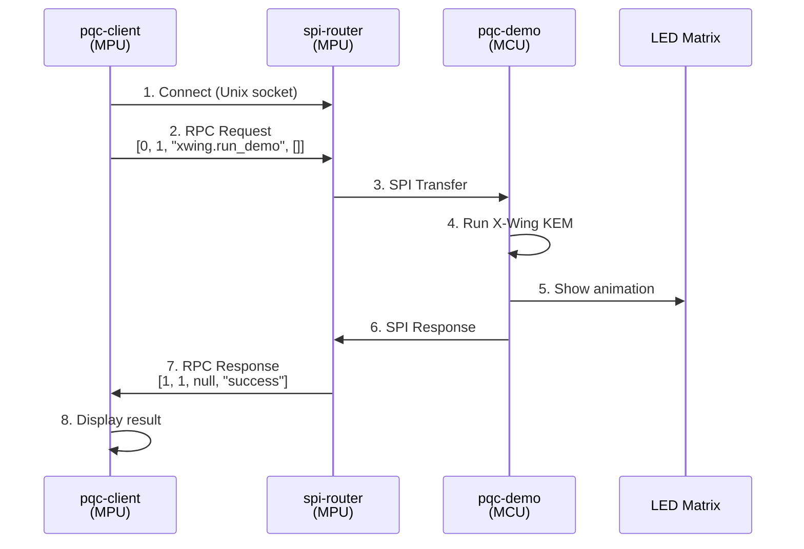
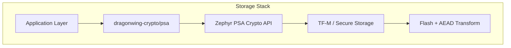

# DragonWing-rs Architecture

## Overview

DragonWing-rs provides Rust libraries and demos for the **Arduino Uno Q** platform, a dual-processor board combining:

- **STM32U585 MCU** - ARM Cortex-M33 running Zephyr RTOS (no_std Rust)
- **QRB2210 MPU** - Qualcomm processor running Linux (std Rust)



## Communication

### SPI Protocol

The MCU and MPU communicate via SPI with a custom framing protocol:



**Frame Details:**
- **Magic**: 2 bytes (`0xAA55`) - Frame sync marker
- **Length**: 2 bytes - Payload length
- **Payload**: Up to 508 bytes - MessagePack-RPC encoded data
- **Total frame size**: 512 bytes (fixed)

### RPC Protocol

MessagePack-RPC is used for structured communication:

| Type | Format | Example |
|------|--------|---------|
| Request | `[0, msg_id, "method", [params...]]` | `[0, 1, "ping", []]` |
| Response | `[1, msg_id, error, result]` | `[1, 1, null, "pong"]` |
| Notify | `[2, "method", [params...]]` | `[2, "log", ["hello"]]` |

## Crate Architecture



### Cross-Platform Crates

Some crates support both MCU and MPU with feature flags:



## Build System

### MCU Builds (Zephyr + Docker)

MCU firmware requires the Zephyr SDK, provided via Docker:

```bash
make docker-build          # Build Docker image (once)
make build-mcu DEMO=pqc-demo  # Build MCU firmware
make flash                 # Flash to board via OpenOCD
```



### MPU Builds (cargo-zigbuild)

MPU apps cross-compile for aarch64 Linux:

```bash
make build-mpu APP=pqc-client  # Cross-compile
make deploy APP=pqc-client     # Deploy via SSH
```



## Data Flow Example

Typical crypto demo flow:



## Security Architecture

### Cryptographic Primitives

| Algorithm | Type | Use Case |
|-----------|------|----------|
| ML-KEM 768 | Post-Quantum KEM | Key encapsulation |
| ML-DSA 65 | Post-Quantum Signature | Digital signatures |
| X-Wing | Hybrid PQ KEM | ML-KEM + X25519 |
| Ed25519 | Classical Signature | Fast signing |
| X25519 | Classical ECDH | Key agreement |
| XChaCha20-Poly1305 | AEAD | Authenticated encryption |
| SAGA | Anonymous Credentials | Unlinkable presentations |

### PSA Secure Storage

The MCU uses Zephyr's PSA Crypto implementation:

- **ITS** (Internal Trusted Storage): Encrypted at rest
- **Key Management**: Hardware-backed key storage
- **Device-unique keys**: Derived from hardware ID


