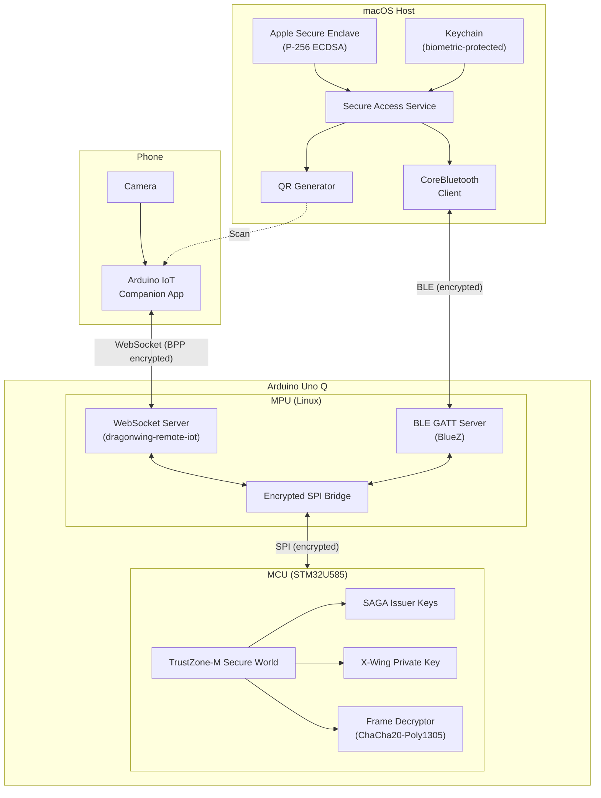
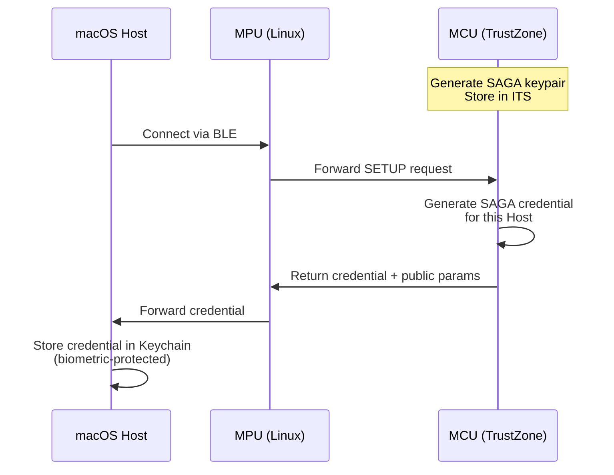
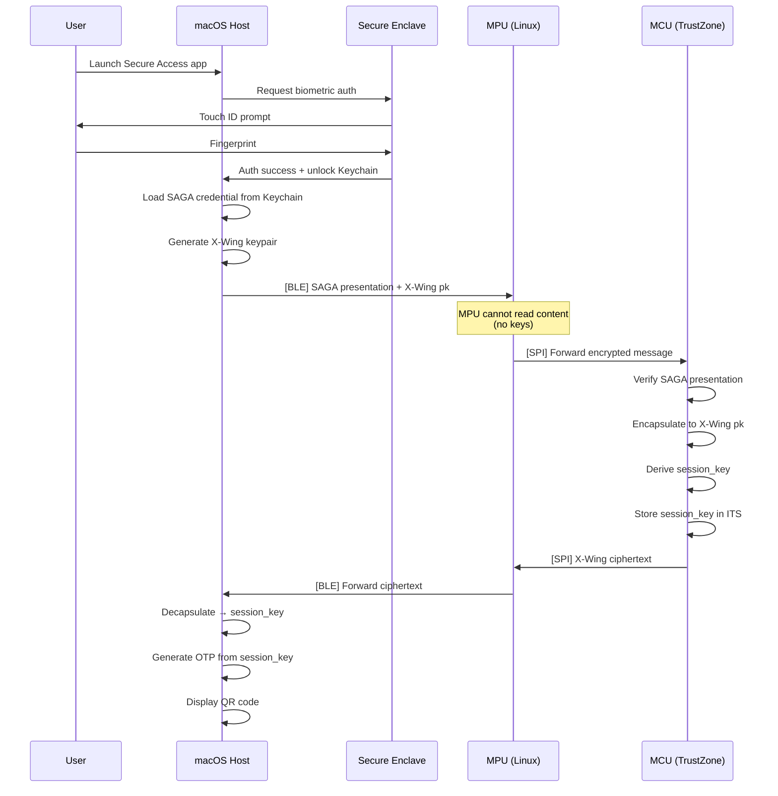
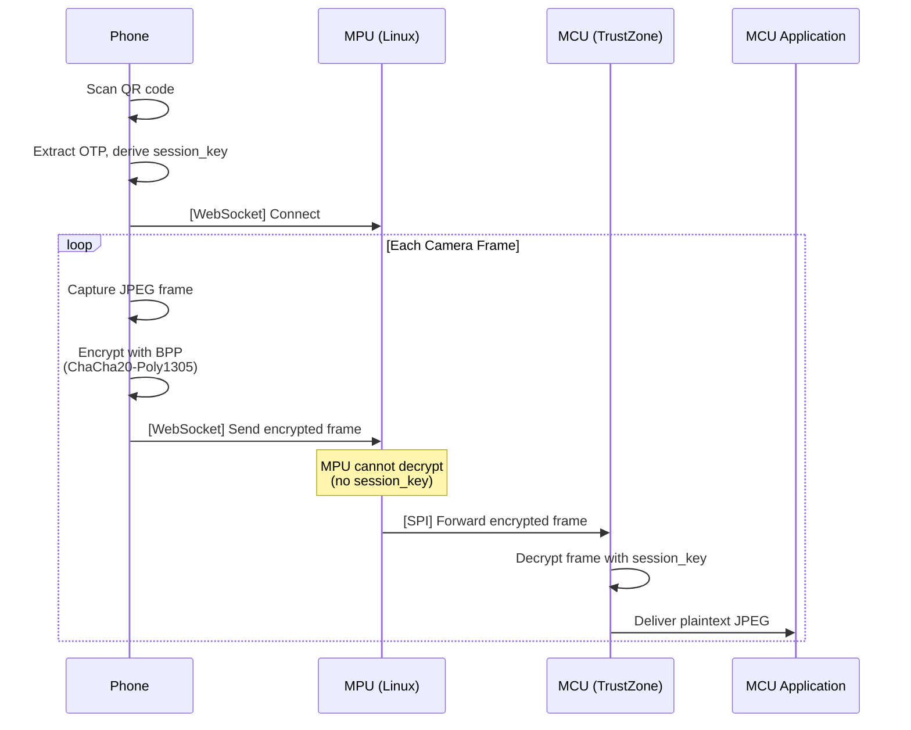
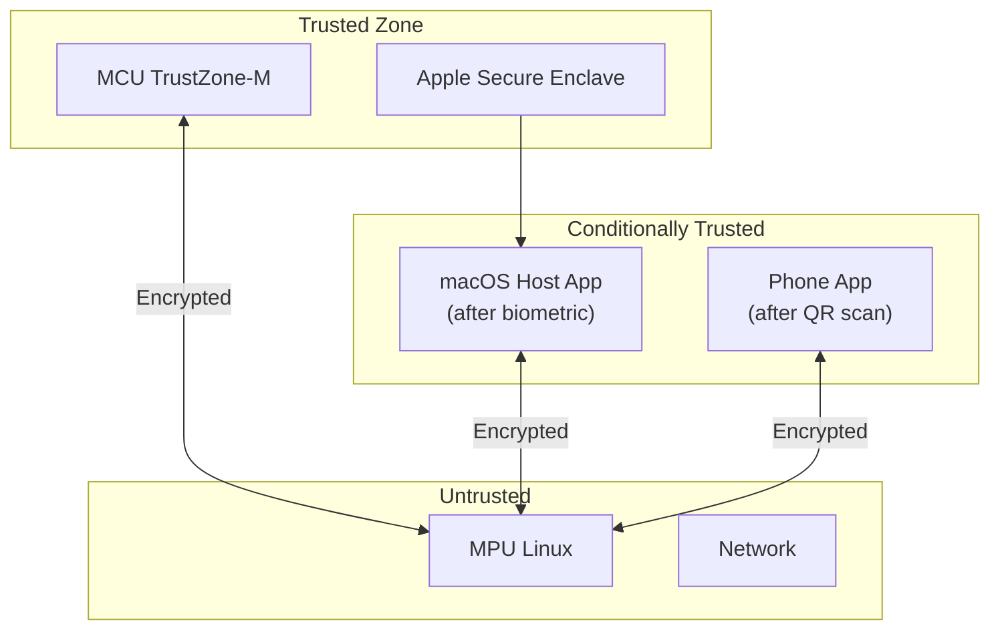
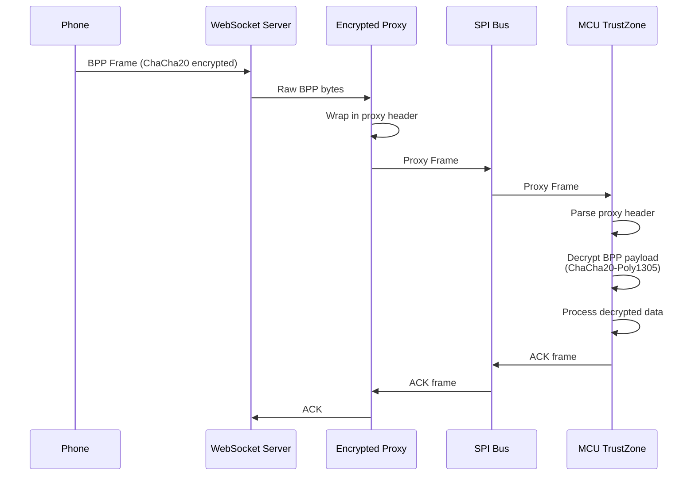

# Secure Access Architecture

## Overview

The Secure Access system provides a **MCU-rooted trust model** for phone-to-Arduino camera streaming, where cryptographic keys never leave the MCU's secure world. The macOS host acts as a trusted coordinator protected by biometric authentication, while the MPU (Linux) serves only as an encrypted transport proxy.

## Threat Model

### Assets to Protect
- Camera frame data from phone
- Session encryption keys
- Device identity/credentials

### Threats Addressed
| Threat | Mitigation |
|--------|------------|
| Trojan on MPU | MPU never sees decryption keys; only forwards ciphertext |
| MITM between Host and Arduino | SAGA+X-Wing authenticated key exchange |
| Stolen phone session | Sessions bound to SAGA credential; short-lived |
| Compromised host app | Biometric unlock via Secure Enclave required |

### Out of Scope
- Physical attacks on MCU
- Side-channel attacks
- Malicious phone app (assumed to be official Arduino IoT Companion)

## System Architecture



## Component Details

### 1. Secure Access Service (macOS)

**Purpose:** Trusted coordinator that manages sessions and provides QR codes for phone pairing.

**Dependencies:**
- `security-framework` - Rust bindings for Apple Security framework
- `btleplug` - Cross-platform BLE library for Rust
- `dragonwing-crypto` - SAGA+X-Wing implementation

**Key Features:**
- Biometric authentication via Touch ID / Secure Enclave
- SAGA credential storage in biometric-protected Keychain
- BLE communication with Arduino via CoreBluetooth
- QR code generation for phone pairing

```rust
// Pseudo-code structure
pub struct SecureAccessService {
    /// Secure Enclave for device authentication
    enclave_key: SecureEnclaveKey,
    /// SAGA credential (stored in Keychain)
    credential: SagaCredential,
    /// BLE connection to Arduino
    ble_client: BleClient,
    /// Active session
    session: Option<Session>,
}

impl SecureAccessService {
    /// Authenticate user with Touch ID
    pub async fn authenticate(&mut self) -> Result<()>;
    
    /// Establish session with MCU via SAGA+X-Wing
    pub async fn establish_session(&mut self) -> Result<Session>;
    
    /// Generate QR code for phone pairing
    pub fn generate_qr(&self) -> Result<QrCode>;
}
```

### 2. BLE GATT Server (MPU)

**Purpose:** Encrypted transport between macOS host and MCU.

**Service Definition:**
```
Service: DragonWing Secure Access
UUID: 0x1234-5678-9ABC-DEF0-... (custom)

Characteristics:
  - Command TX (Write): Host → MPU → MCU
    UUID: 0x0001
    Max size: 512 bytes
    
  - Command RX (Notify): MCU → MPU → Host  
    UUID: 0x0002
    Max size: 512 bytes
    
  - Status (Read): Connection state
    UUID: 0x0003
```

**Implementation:** Uses BlueZ D-Bus API via `bluer` crate.

### 3. Encrypted SPI Bridge (MPU)

**Purpose:** Forward encrypted BLE messages to MCU without decryption.

```rust
// Message routing
pub enum BridgeMessage {
    /// From BLE, forward to MCU via SPI
    BleToMcu(Vec<u8>),
    /// From MCU via SPI, forward to BLE
    McuToBle(Vec<u8>),
    /// From WebSocket, forward to MCU via SPI  
    WsToMcu(Vec<u8>),
    /// From MCU via SPI, forward to WebSocket
    McuToWs(Vec<u8>),
}
```

The bridge is **stateless** and **encryption-agnostic** - it simply routes bytes.

### 4. MCU Secure World (STM32U585)

**Purpose:** Root of trust; holds all cryptographic secrets.

**Stored in TrustZone-M:**
- SAGA issuer keypair (for credential verification)
- X-Wing secret key (for decapsulation)
- Per-session BPP key (for frame decryption)

**PSA Storage:**
```rust
// Key IDs in Internal Trusted Storage
const SAGA_KEYPAIR_UID: u64 = 0x1001;
const XWING_SEED_UID: u64 = 0x1002;
const SESSION_KEY_UID: u64 = 0x1003;
```

### 5. Phone Integration

The phone uses the existing **Arduino IoT Companion App** which:
1. Scans QR code containing: `https://cloud.arduino.cc/installmobileapp?otp=${OTP}&protocol=ws&ip=${IP}&port=${PORT}`
2. Connects to WebSocket server on MPU
3. Sends camera frames using BPP (Binary Pairing Protocol) encryption

**Key Derivation:**
```
OTP = Base64(random_bytes(16))
session_key = HKDF-SHA256(
    ikm = saga_xwing_shared_secret,
    salt = "dragonwing-secure-access-v1",
    info = "bpp-encryption-key"
)
```

The phone derives the same key from the OTP embedded in the QR code.

## Protocol Flows

### Initial Setup (One-Time)



### Session Establishment



### Camera Streaming



## Security Analysis

### Key Distribution

| Key | Location | Protection |
|-----|----------|------------|
| SAGA Issuer Secret | MCU TrustZone | Hardware isolation |
| X-Wing Secret | MCU TrustZone | Hardware isolation |
| Session Key (BPP) | MCU TrustZone | Hardware isolation |
| SAGA Credential (Host) | macOS Keychain | Biometric + SE |
| OTP (Phone) | Phone memory | QR one-time transfer |

### Trust Boundaries



### Attack Scenarios

**Scenario 1: Malware on MPU**
- Attacker has root on Linux MPU
- Can intercept all SPI and network traffic
- **Cannot** decrypt because session_key is in MCU TrustZone
- **Cannot** forge SAGA presentations (lacks credential)

**Scenario 2: Stolen macOS device**
- Attacker has physical access to Mac
- Cannot access Keychain without biometric
- Cannot generate valid sessions

**Scenario 3: QR code intercepted**
- Attacker photographs QR code
- Can derive session_key from OTP
- **Mitigated by:** Short session lifetime, single-use OTP

## BPP Encryption Details

The Binary Pairing Protocol (BPP) uses **ChaCha20-Poly1305 (RFC 8439)** for authenticated encryption of camera frames.

### BPP Frame Format
```
[Version:1][Mode:1][Timestamp:8][Random:4][Payload:Var][AuthTag:16]
|<--------- Header (14 bytes) --------->|<-- Ciphertext -->|<- 16 -->|
                 |<---- 12-byte Nonce --->|
```

| Field | Size | Description |
|-------|------|-------------|
| Version | 1 byte | Protocol version (0x00) |
| Mode | 1 byte | Security mode: 0=None, 1=Sign, 2=Encrypt |
| Timestamp | 8 bytes | Big-endian microseconds since UNIX epoch |
| Random | 4 bytes | Random nonce component |
| Payload | Variable | Encrypted data (JPEG frame, IMU, etc.) |
| AuthTag | 16 bytes | Poly1305 authentication tag |

### Encryption Parameters
- **Algorithm**: ChaCha20-Poly1305 (RFC 8439)
- **Key Size**: 32 bytes (256 bits)
- **Nonce Size**: 12 bytes (96 bits) = Timestamp(8) + Random(4)
- **Tag Size**: 16 bytes (128 bits)
- **AAD**: The 14-byte header is authenticated but not encrypted

### Why ChaCha20-Poly1305 (not XChaCha20)?
- BPP was designed for mobile apps that use **timestamp + random** nonces (12 bytes)
- XChaCha20 uses 24-byte nonces for random-safe generation
- The hybrid timestamp+random scheme provides adequate nonce uniqueness
- ChaCha20 is slightly faster (no HChaCha20 subkey derivation)

## Encrypted Proxy Protocol

The encrypted proxy protocol wraps BPP frames for SPI transport between MPU and MCU.

### Proxy Frame Format
```
[Magic:2][Type:1][Length:2][Sequence:2][Reserved:1][Payload:Var]
```

| Field | Size | Description |
|-------|------|-------------|
| Magic | 2 bytes | "DE" (0x44, 0x45) for DragonWing Encrypted |
| Type | 1 byte | Frame type (see below) |
| Length | 2 bytes | Big-endian payload length |
| Sequence | 2 bytes | Big-endian sequence number |
| Reserved | 1 byte | Reserved (0x00) |
| Payload | Variable | Raw BPP frame (unchanged) |

### Frame Types
```rust
enum ProxyFrameType {
    EncryptedVideo  = 0x01,  // Camera frame
    EncryptedImu    = 0x02,  // IMU data
    EncryptedGps    = 0x03,  // GPS data
    EncryptedSensor = 0x04,  // Other sensors
    SessionInit     = 0x10,  // Key exchange init
    SessionAck      = 0x11,  // Key exchange ack
    Heartbeat       = 0x20,  // Keep-alive
    Error           = 0xFF,  // Error response
}
```

### Data Flow


## Implementation Roadmap

### Phase 1: Core Infrastructure ✅
1. MCU: Implement SAGA+X-Wing responder over SPI
2. MPU: Implement BLE GATT server with BlueZ
3. MPU: Implement encrypted SPI bridge

### Phase 2: macOS Host
1. Implement CoreBluetooth client
2. Implement Secure Enclave integration
3. Implement Keychain storage with biometric protection
4. Implement QR code generation

### Phase 3: Integration ✅
1. Update `dragonwing-remote-iot` for encrypted proxy mode
2. Add ChaCha20-Poly1305 to `dragonwing-crypto`
3. Update MCU secure-access demo with BPP decryption
4. End-to-end testing with Arduino IoT Companion App
5. Security audit

## Crate Structure

```
crates/
├── dragonwing-secure-access/     # macOS host application
│   ├── src/
│   │   ├── lib.rs
│   │   ├── ble.rs               # CoreBluetooth client
│   │   ├── keychain.rs          # Keychain + Secure Enclave
│   │   ├── session.rs           # Session management
│   │   └── qr.rs                # QR code generation
│   └── Cargo.toml
│
├── dragonwing-ble-bridge/        # MPU BLE↔SPI bridge
│   ├── src/
│   │   ├── lib.rs
│   │   ├── gatt.rs              # BLE GATT server
│   │   └── bridge.rs            # Message routing
│   └── Cargo.toml
│
└── dragonwing-crypto/            # Existing (add TrustZone APIs)
    └── src/
        └── trustzone/            # TrustZone-M secure world APIs
            ├── mod.rs
            ├── session.rs        # Session key management
            └── responder.rs      # SAGA+X-Wing responder
```

## Configuration

### Environment Variables

```bash
# .env (macOS host)
ARDUINO_BLE_DEVICE_NAME="DragonWing-UnoQ"
SESSION_TIMEOUT_SECS=3600
QR_DISPLAY_SECS=60

# On Arduino MPU
DRAGONWING_BLE_ENABLED=true
DRAGONWING_SPI_DEVICE=/dev/spidev0.0
```

### BLE Advertising

```rust
// MPU BLE configuration
const DEVICE_NAME: &str = "DragonWing-UnoQ";
const SERVICE_UUID: Uuid = uuid!("12345678-1234-5678-1234-567812345678");
const APPEARANCE: u16 = 0x0080; // Generic Computer
```

## Quick Start

### Prerequisites
- Arduino Uno Q board with IP `192.168.1.199`
- Rust installed on the board (via `make remote-setup`)
- Docker for MCU builds

### 1. Build and Flash MCU Firmware
```bash
# Build the secure-access MCU demo
make build-mcu DEMO=secure-access

# Flash to the MCU
make flash
```

### 2. Build and Deploy MPU Components
```bash
# Build the remote-iot demo with encrypted proxy support
make remote-build-mpu APP=remote-iot-demo FEATURES=encrypted-proxy

# Install to the board
make remote-install APP=remote-iot-demo
```

### 3. Run the System
```bash
# SSH to the board
ssh arduino@192.168.1.199

# Start the remote-iot demo in proxy mode
/home/arduino/remote-iot-demo --proxy --spi-device /dev/spidev0.0
```

### 4. Monitor MCU Logs
```bash
# From host, open serial console
make serial
```

### Testing the Flow
1. MCU boots and waits for proxy frames
2. Phone connects via WebSocket and sends BPP-encrypted camera frames
3. MPU proxies frames to MCU via SPI (cannot decrypt)
4. MCU decrypts frames using session key in TrustZone
5. MCU logs decryption success/failure

## Troubleshooting

### MCU Decryption Fails
- Check that phone and MCU are using the same session key
- Verify BPP nonce format: timestamp(8) + random(4) = 12 bytes
- Ensure AAD (header) matches exactly

### SPI Communication Issues
- Check SPI device path: `/dev/spidev0.0` or `/dev/spidev1.0`
- Verify proxy frame magic bytes: "DE" (0x44, 0x45)
- Check frame length doesn't exceed 4096 bytes

### BLE Connection Issues
- Ensure BLE bridge is running: `systemctl status dragonwing-ble-bridge`
- Check BlueZ service: `systemctl status bluetooth`
- Verify device is advertising: `bluetoothctl scan on`
